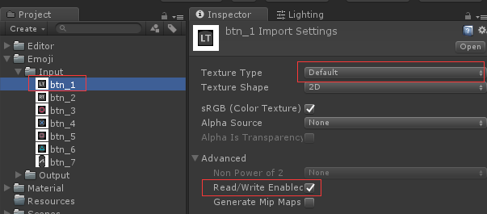
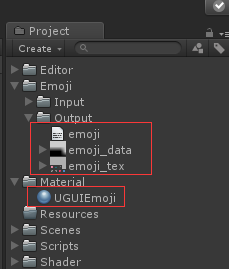
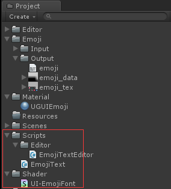
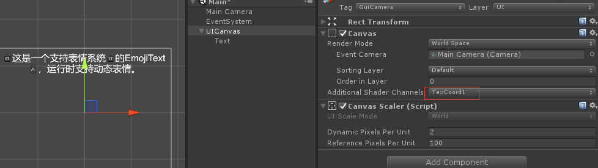
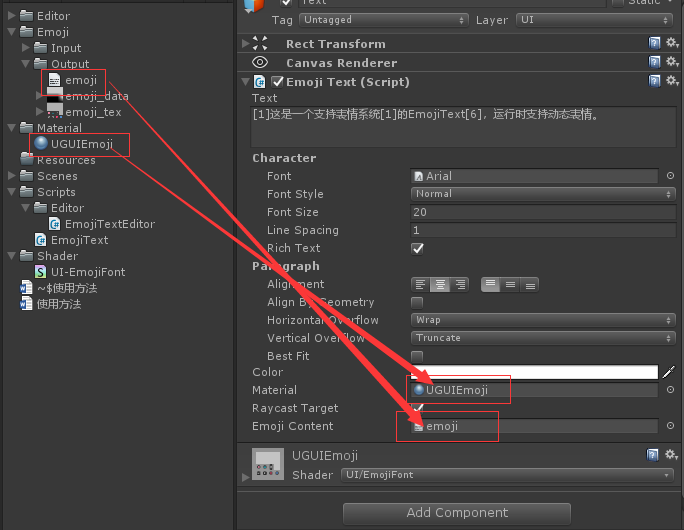

# EmojiText
Based on UGUI to support emoji system on Text component.

# 工程信息
* 原工程地址：https://github.com/zouchunyi/EmojiText
* 原作者:zouchunyi	zouchunyi@kingsoft.com

**本工程修改**
* 取消EmojiContent从Resources目录加载，改为手动配置在EmojiText控件中
* 修复多国语言下，某些语言无法正确显示图片的问题

# 操作步骤

Unity Version: 2017

1. 准备若干张需要用到的图片，命名为XXX_1，XXX_2……，注意XXX不能带下划线
2. 将图片全部放在Emoji/Input中，勾选全部图片的Read/Write Enable属性

3. 使用菜单中的EmojiText/Build Emoji，程序将自动创建相关的材质，贴图以及text数据

4. 拷贝这些数据到主工程中
5. 将Script和Shader文件夹拷贝到主工程中

6. 在主工程创建UI面板，设置Canvas的Additional Shader Channal为TexCoord1

7. 创建新物体，添加EmojiText组件，设置Material和EmojiContent属性，运行就可以看到效果

